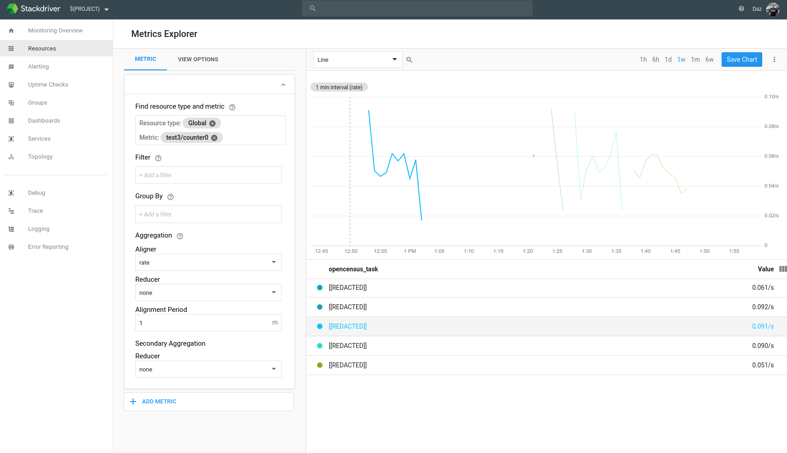

## OpenCensus Importer

__TL;DR__ [OpenCensus](opencensus.io) provides a one-way proxy between your apps' stats sources and monitoring solution sinks. OpenCensus Importers provide the return path.

OpenCensus enables things that produce data (your apps) to do so in a monitoring agnostic way. Write your monitoring code once and be confident that, when SRE wants to monitor it, they’ll be able to do so using their preferred monitoring system; [Prometheus](https://opencensus.io/exporters/supported-exporters/go/prometheus/), [Datadog](https://opencensus.io/exporters/supported-exporters/go/datadog/), [Stackdriver](https://opencensus.io/exporters/supported-exporters/go/stackdriver/) (AWS|Google) and [Azure Monitor](https://opencensus.io/exporters/supported-exporters/go/applicationinsights/) are all implemented (at least for Golang) and more are being added.

Google’s [Trillian](github.com/google/trillian) project supports Prometheus. In attempting to write (needs updating: link) an OpenCensus solution for Trillian, I was unable to pass Trillian’s monitoring-specific tests. This is because, Trillian’s interface for monitoring assumes the ability to read measurements and OpenCensus Exporters (!) don’t permit reading values from the monitoring system.

And, since OpenCensus is a pluggable solution that supports arbitrary Exporters, each of the services would require a solution for reading values too.

My use(ful|less)(?) solution is to consider the notion of OpenCensus Importers (sic.) and mirror the interface of Exporters to see whether it’s practical and useful to read values too

## Getting Started

The code adds a type "Importer" that closely mirrors the creation of OpenCensus Exporters.

The following code defines Stackdriver and Datadog exporters:
```golang
sd, err := stackdriver.NewExporter(stackdriver.Options{
    MetricPrefix: namespace,
})
if err != nil {
    log.Fatal(err)
}
defer sd.Flush()

view.RegisterExporter(sd)

dd, err := datadog.NewExporter(datadog.Options{
    Namespace: namespace,
})
if err != nil {
    log.Fatal(err)
}
defer dd.Stop()

view.RegisterExporter(dd)
```

Here's the equivalent code for the importers:
```golang
sd, err := stackdriver.NewImporter(stackdriver.Options{
    MetricPrefix: namespace,
})
if err != nil {
    log.Fatal(err)
}

view.RegisterImporter(sd)

dd, err := datadog.NewImporter(datadog.Options{
    Namespace: namespace,
})
if err != nil {
    log.Fatal(err)
}

view.RegisterImporter(dd)
```

## Implementation

The devil is in the details and the challenge for the Importers is in reconciling values exported with those in the monitoring services' time-series data. For simplicity, the code looks for the most-recent time-series and the most-recent value of that time-series. This leaves room for improvement because it remains not possible to automatically reconcile these values for use in Golang testing [what I'd set out to achieve!]

## Examples

I've implemented Importers for Stackdriver and Datadog.

You'll need to clone (then rename a directory):
```bash
WORKDIR=[[YOUR-WORKDIR]]

cd ${WORKDIR}
mkdir go
EXPORT GOPATH=${WORKDIR}/go
EXPORT PATH=${GOPATH}/bin:${PATH}

# Grab the code
git clone github.com/dazwilkin/opencensus-testing

# Unfortunately, I chose a bad github repo name, this will rename it
mv \
  ${GOPATH}/src/github.com/dazwilkin/opencensus-testing \
  ${GOPATH}/src/github.com/dazwilkin/opencensus

cd ${GOPATH}/src/github.com/dazwilkin/opencensus/examples
```

### Stackdriver

You'll need a Google Cloud Platform (GCP) project with a Stackdriver monitoring workspace created. Unfortunately, Google does not yet provide an API for automating Stackdriver but, the following will create the project and create a service account that can read|write Stackdriver metrics:

```bash
WORKDIR=[[YOUR-WORKDIR]]
PROJECT=[[YOUR-PROJECT]]
ACCOUNT=[[YOUR-ACCOUNT]]

# Create GCP Project
gcloud projects create ${PROJECT}

# Create Service Account (in $PROJECT) and assign Stackdriver read|write metrics permissions

FILE="${WORKDIR}/${ACCOUNT}.key.json"
gcloud iam service-accounts create $ACCOUNT \
--display-name=$ACCOUNT \
--project=$PROJECT

gcloud iam service-accounts keys create ${FILE} \
--iam-account=${ACCOUNT}@${PROJECT}.iam.gserviceaccount.com \
--project=$PROJECT

for ROLE in "monitoring.metricWriter" "monitoring.viewer"
do
  gcloud projects add-iam-policy-binding $PROJECT \
  --member=serviceAccount:${ACCOUNT}@${PROJECT}.iam.gserviceaccount.com \
  --role=roles/${ROLE}
done

# This should take you to the Stackdriver Console workspace provisioner for $PROJECT
google-chrome app.google.stackdriver.com/account/login/${PROJECT}
```

The code needs to know the `${PROJECT}` and be provided with the service acccount key using `${GOOGLE_APPLICATION_CREDENTIALS}`. The test runs for 10-minutes. Every 10-seconds it writes a random metric value. Every 30-seconds it attempts to read the latest value for the metric from Stackdriver. There's an initial period of latency during which Stackdriver has not created and begun reporting on the metric.

Once you've completed the above, you can either:

#### Visual Studio Code

To run the code under Visual Studio Code's debugger, you'll need to provide the environment variables to the debugger using the launch.json file.

You will need to replace the environment variables with their values of the environment variables:
```json
{
    "version": "0.2.0",
    "configurations": [
        {
            "name": "stackdriver",
            "type": "go",
            "request": "launch",
            "mode": "auto",
            "program": "${fileDirname}",
            "env": {
                "GOOGLE_APPLICATION_CREDENTIALS":"${WORKDIR}/${ACCOUNT}.key.json",
                "PROJECT":"${PROJECT}"
            },
            "args": []
        }
    ]
}
```

#### Command-line

```bash
cd ${GOPATH}/src/github.com/dazwilkin/opencensus/examples/stackdriver

GOOGLE_APPLICATION_CREDENTIALS=${WORKDIR}/${ACCOUNT}.key.json \
PROJECT=${PROJECT} \
go run stackdriver.go
```

#### Output

If annotated the output below. Once Stackdriver creates the metric (`custom.googleapis.com/opencensus/counter0`), it initially reads zero values but then begins reporting non-zero values (2.910321, 5.582988). These correpond to values that were written to Stackdriver by the OpenCensus exporter. I've noted where these were written with `<-----`

```
13:36:56.781803   41615 stackdriver.go:36] [NewImporter] MetricPrefix (test3) was provided but this only affects the metric's displayed name *not* its type
13:36:56.782222   41615 stackdriver.go:111] write: 0.229483 [0.229483]
13:37:06.782394   41615 stackdriver.go:111] write: 0.614054 [0.843537]
13:37:16.782678   41615 stackdriver.go:111] write: 0.501579 [1.345116]
resource.type="global" metric.type="custom.googleapis.com/opencensus/counter0" metric.label."key1"="value1" metric.label."key2"="value2"
13:37:26.782950   41615 stackdriver.go:111] write: 0.667293 [2.012408]
13:37:27.181332   41615 stackdriver.go:134] reads: 0.000000 [No timeseries match the filter]
13:37:36.783165   41615 stackdriver.go:111] write: 0.564973 [2.577382]
13:37:46.783495   41615 stackdriver.go:111] write: 0.332939 [2.910321]                                  <-----
13:37:56.783848   41615 stackdriver.go:111] write: 0.643648 [3.553969]
resource.type="global" metric.type="custom.googleapis.com/opencensus/counter0" metric.label."key1"="value1" metric.label."key2"="value2"
13:37:57.281843   41615 stackdriver.go:134] reads: 0.000000 [No timeseries match the filter]
13:38:06.784210   41615 stackdriver.go:111] write: 0.330163 [3.884132]
13:38:16.784448   41615 stackdriver.go:111] write: 0.478413 [4.362545]
13:38:26.784617   41615 stackdriver.go:111] write: 0.449236 [4.811781]
resource.type="global" metric.type="custom.googleapis.com/opencensus/counter0" metric.label."key1"="value1" metric.label."key2"="value2"
13:38:27.482939   41615 stackdriver.go:134] reads: 2.910321
13:38:36.784786   41615 stackdriver.go:111] write: 0.247195 [5.058976]
13:38:46.785031   41615 stackdriver.go:111] write: 0.524012 [5.582988]                                  <-----
13:38:56.785246   41615 stackdriver.go:111] write: 0.505292 [6.088279]
resource.type="global" metric.type="custom.googleapis.com/opencensus/counter0" metric.label."key1"="value1" metric.label."key2"="value2"
13:38:57.585260   41615 stackdriver.go:134] reads: 0.000000 [No timeseries match the filter]
13:39:06.785452   41615 stackdriver.go:111] write: 0.905061 [6.993341]
13:39:16.785775   41615 stackdriver.go:111] write: 0.204985 [7.198326]
13:39:26.785985   41615 stackdriver.go:111] write: 0.700681 [7.899007]
resource.type="global" metric.type="custom.googleapis.com/opencensus/counter0" metric.label."key1"="value1" metric.label."key2"="value2"
13:39:27.736481   41615 stackdriver.go:134] reads: 5.582988
```

You should also be able to visualize the metric using the Stackdriver console:



You may also query the data using Google APIs Explorer:

https://developers.google.com/apis-explorer/#search/stackdriver%20monitoring%20timeseries/m/monitoring/v3/monitoring.projects.timeSeries.list

Complete the fields as shown below; replace ${PROJECT} with your value and replace the interval dates with correct dates
```
name: projects/${PROJECT}
filter: resource.type="global" metric.type="custom.googleapis.com/opencensus/counter0" metric.label."key1"="value1" metric.label."key2"="value2"
interval.endTime: 2018-12-28T23:59:59-08:00
interval.startTime: 2018-12-28T00:00:00-08:00
```

### Datadog

To export to Datadog, you will need a Datadog account.

OpenCensus routes metric data to the Datadog Agent. By default, the OpenCensus Importer code assumes the Agent is running on localhost:8125 (UDP). If necessary, you may reconfigure this. Otherwise, you may run the Datadog Agent in a docker container:

```bash
DD_API=[[YOUR-API-KEY]] \

docker run \
--volume=/var/run/docker.sock:/var/run/docker.sock:ro \
--volume=/proc/:/host/proc/:ro \
--volume=/sys/fs/cgroup/:/host/sys/fs/cgroup:ro \
--env=DD_API_KEY=${DD_API} \
--env=DD_DOGSTATSD_NON_LOCAL_TRAFFIC=true \
--publish=8125:8125/udp
datadog/agent:latest
```

The code expects to find a Datadog API key and an Application key in the environment. You may generate both of these (for this code specifically) from the Datadog console.

#### Visual Studio Code

```json
{
    "version": "0.2.0",
    "configurations": [
        {
            "name":"datadog",
            "type":"go",
            "request":"launch",
            "mode":"auto",
            "program":"${fileDirname}",
            "env":{
                "DD_API":"[[YOUR-API-KEY]]",
                "DD_APP":"[[YOUR-APP-KEY]]"
            }
        }
    ]
}
```

#### Command-line

```bash
cd ${GOPATH}/src/github.com/dazwilkin/opencensus/examples/datadog

DD_API=[[YOUR-API-KEY]] \
DD_APP=[[YOUR-APP-Key]] \
go run stackdriver.go
```

#### Output

The output is similar to the output with Stackdriver and, as before, you should see the values being `read` lagging the values being `write`

```
15:46:17.931677  145513 datadog.go:105] write: 0.131392 [0.131392]                                              <-----
15:46:27.933924  145513 datadog.go:105] write: 0.255955 [0.387347]
15:46:37.934179  145513 datadog.go:105] write: 0.597532 [0.984879]
2018/12/28 15:46:47 namespace.counter0_key1_key2{host:[[REDACTED]],key1:value1,key2:value2}
15:46:47.934443  145513 datadog.go:105] write: 0.450027 [1.434906]                                              <-----
15:46:48.594416  145513 datadog.go:128] reads: 0.000000
15:46:57.934719  145513 datadog.go:105] write: 0.840127 [2.275033]
15:47:07.935112  145513 datadog.go:105] write: 0.152052 [2.427085]
15:47:17.935361  145513 datadog.go:105] write: 0.322900 [2.749985]
2018/12/28 15:47:18 namespace.counter0_key1_key2{key2:value2,host:[[REDACTED]],key1:value1}
2018/12/28 15:47:18 Metric: namespace.counter0_key1_key2
2018/12/28 15:47:18 [2018-12-28 15:46:20 -0800 PST] 0.1313920021057129
15:47:18.764932  145513 datadog.go:128] reads: 0.131392
15:47:27.935625  145513 datadog.go:105] write: 0.752043 [3.502029]
15:47:37.935903  145513 datadog.go:105] write: 0.807656 [4.309684]
15:47:47.936222  145513 datadog.go:105] write: 0.811163 [5.120848]
2018/12/28 15:47:48 namespace.counter0_key1_key2{host:[[REDACTED]],key1:value1,key2:value2}
2018/12/28 15:47:48 Metric: namespace.counter0_key1_key2
2018/12/28 15:47:48 [2018-12-28 15:46:50 -0800 PST] 1.434906005859375
15:47:48.933070  145513 datadog.go:128] reads: 1.434906
15:47:57.936494  145513 datadog.go:105] write: 0.287678 [5.408526]
15:48:07.936751  145513 datadog.go:105] write: 0.487006 [5.895531]
```

You should also be able to find the metric using Datadog's metric explorer:


## Conclusion

That's all.
